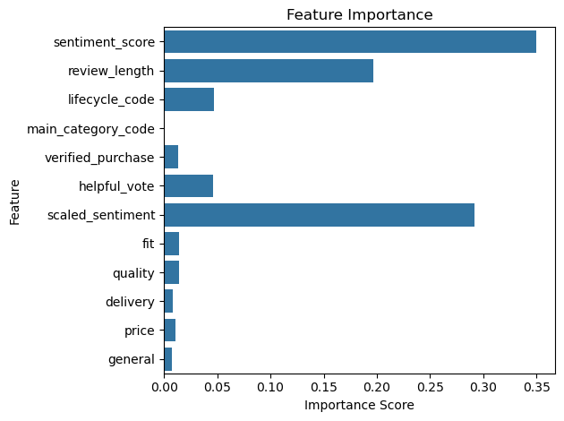
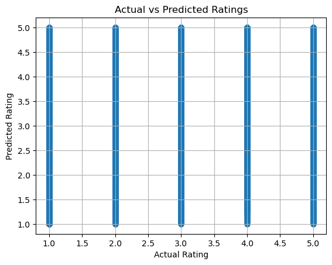
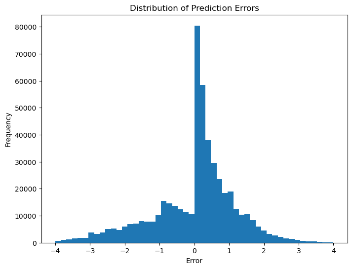

# 🧵 Predicting Product Ratings from Fashion Reviews

## 💡 Project Objective
Explore how sentiment, aspect mentions, and product lifecycle stages influence customer ratings in fashion retail.

## 📦 Dataset
- Source: Amazon Fashion Review Dataset
- Size: ~2.5 million reviews
- Features: review text, rating, verified purchase, helpful votes, category, timestamps

## 🧠 Methodology
- Text cleaning + polarity scoring with TextBlob
- Aspect tagging: `fit`, `quality`, `delivery`, `price`, `general`
- Lifecycle modeling based on product launch dates
- Feature engineering: review length, scaled sentiment, lifecycle encoding

## ⚙️ Model
- **Algorithm**: Random Forest Regressor
- **Target**: Star rating (1.0–5.0)
- **Features**: Sentiment, lifecycle stage, aspect flags, metadata

## 📊 Evaluation
- MAE: **0.81**
- RMSE: **1.19**
- Top predictors: `sentiment_score`, `review_length`
- Feature importance and scatter/residual plots used for interpretation

## 🎨 Visuals
  
  

## 🔍 Insights
- Sentiment polarity plays the strongest role in prediction
- Lifecycle and aspect signals show potential but need deeper modeling
- Model is well-calibrated with tight error distribution

## 🔭 Future Work
- Explore XGBoost or Ordinal Regression
- SHAP interpretation for local explainability
- Interaction terms between sentiment and aspects or lifecycle stages

## 🧰 Tech Stack
Python · pandas · scikit-learn · TextBlob · matplotlib · seaborn

## 👩🏾‍💻 About the Author
Project by Yetunde Olajumoke Olaleye  
Current MSc Business Analytics student at the University of Greenwich  
Passionate about NLP, consumer behavior, and data-driven strategy
